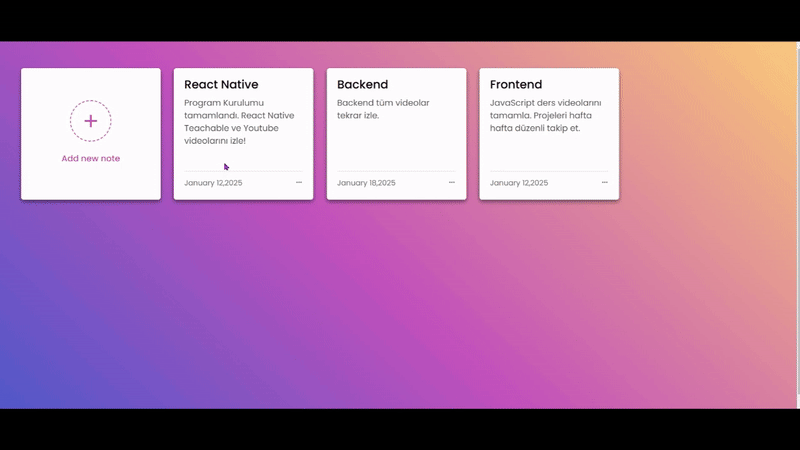

# NoteKeeper

NoteKeeper is a simple, user-friendly web application for creating, managing, and storing notes. It allows users to add, edit, delete, and organize their notes seamlessly with a visually appealing interface.

## Features

- Add Notes: Quickly create and save your notes.
- Edit Notes: Update existing notes with ease.
- Delete Notes: Remove notes you no longer need.
- Local Storage: Your notes are stored securely in your browser's local storage.
- Responsive Design: Works smoothly on both desktop and mobile devices.

## Technologies Used

- HTML: Structure and layout of the app.
- CSS: Styled with a modern, vibrant design.
- JavaScript: Handles app logic and user interactions.

<h2>GitHub Repository</h2>

You can find the source code on GitHub: [NoteKeeper Repository](https://github.com/your-username/NoteKeeper)

